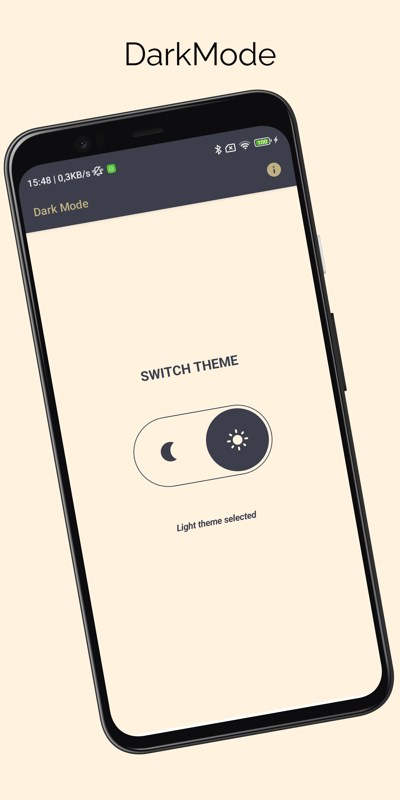

# DarkMode
> <b>Author: Nicola De Nicolais</b>

## 📄 Description
Android application built with Kotlin and Jetpack Compose that shows how to switch theme between light and dark mode. Compose provides the Colors class to model the Material color system and provides builder functions to create sets of light or dark colors. You can create a light set of colors using the baseline values, use lightColors while to create a dark set of colors using the baseline values, use darkColors. 

## 🔨  How to install and run the project
Clone this repository :<br/>
`
git clone https://github.com/ndenicolais/DarkMode.git
`

Import the project into Android Studio :

1. File -> New -> Import Project
2. Browse to <path_to_project>
3. Click "OK"

Create a new virtual device or connect an Android device to your computer.</br>
Click Run to start the project on the selected device.

## 🛠️ Built with
Kotlin</br>
Jetpack Compose

## ✏️ Customization
The Material design system contains 4 types of colors:
#### Primary and secondary colors<br/>
- *primary*: Color displayed most frequently across your app’s screens and components.
- *secondary*: Color thtat provides more ways to accent and distinguish your product
***
#### Variants of primary and secondary colors<br/>
- *primaryVariant*: Color used to distinguish two elements of the app using the primary color, such as the top app bar and the system bar.
- *secondaryVariant*: Color used to distinguish two elements of the app using the secondary color.
***
#### Additional colors<br/>
Colors that refer to: background, surface, and error colors included in additional colors.
- *background*: Color that appears behind the sliding content. It is the background color of the app UI.
- *surface*:  Color used on surfaces of components, such as cards, sheets and menus.
- *error*: Color used to indicate error within components, such as text fields.
***
####  On Colors
Colors that are applied to the elements (like text and icons) that appear on top of certain colors (like primary and secondary). There are 5 on colors:
- *onPrimary*: Color used for text and icons displayed on top of the primary color.
- *onSecondary*: Color used for text and icons displayed on top of the secondary color.
- *onBackground*: Color used for text and icons displayed on top of the background color.
- *onSurface*: Color used for text and icons displayed on top of the surface color.
- *onError*: Color used for text and icons displayed on top of the error color.

***
- *isLight* refer to whether the Colors set is considered as a 'light' or 'dark' set of colors.

## Public constructor

```
Colors(
    primary: Color,
    primaryVariant: Color,
    secondary: Color,
    secondaryVariant: Color,
    background: Color,
    surface: Color,
    error: Color,
    onPrimary: Color,
    onSecondary: Color,
    onBackground: Color,
    onSurface: Color,
    onError: Color,
    isLight: Boolean
)
```

## 📚 Package Structure

```
com.denicks21.recorder          # Root Package
│ 
├── ui                          # UI resources folder
│   ├── composables             # Composable components folder
|   │   ├── BackPress           # Component that control and prevent back button action.
|   │   ├── Switcher            # Component that switch theme.
|
├── theme                       # Theme components folder
|   │   ├── Color               # Color palette used by the app.
|   │   ├── Shape               # Components shapes of Compose used by the app.
|   │   ├── Theme               # Theme used by the app.
|   │   ├── Type                # Typography styles for the fonts used by the app.
|
├── MainActivity                # Main activity
```

## 📎 Screenshots
<p float="left">

