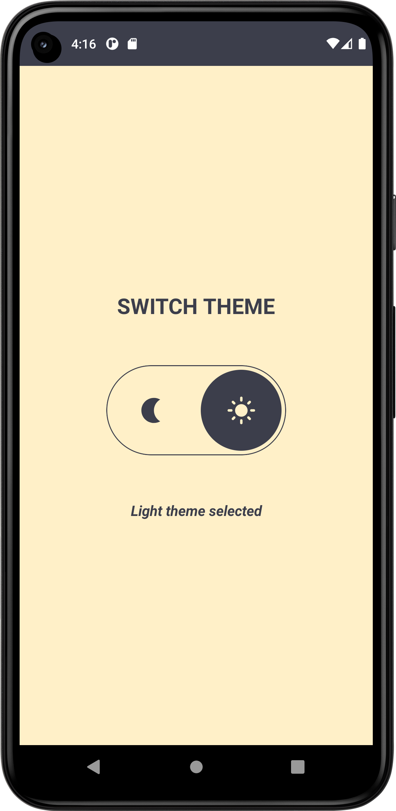
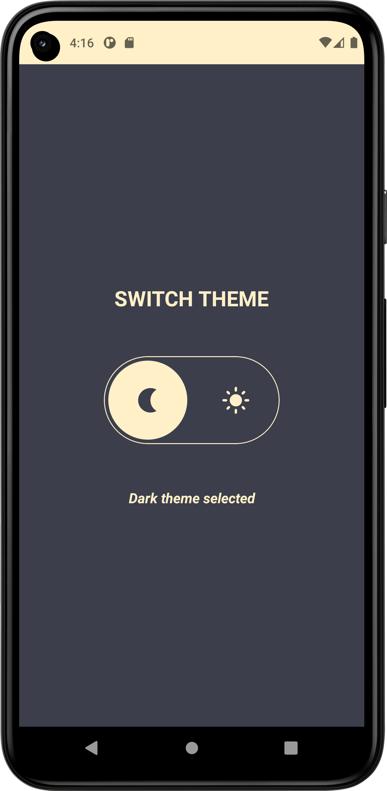

# ComposeDarkMode
> <b>Author: Nicola De Nicolais</b>

## 📍 Description
Android application built with Kotlin and Jetpack Compose that shows how to switch theme between light and dark mode.

## 🛠️ Package Structure

```
com.denicks21.recorder          # Root Package
│ 
├── ui                          # UI resources folder
│   ├── composables             # Composable components folder
|   │   ├── Switcher            # Component that switch theme.
|
├── theme                       # Theme components folder
|   │   ├── Color               # Color palette used by the app.
|   │   ├── Shape               # Components shapes of Compose used by the app.
|   │   ├── Theme               # Theme used by the app.
|   │   ├── Type                # Typography styles for the fonts used by the app.
|
├── MainActivity                # Main activity
```

## 📎 Screenshots
<p float="left">


